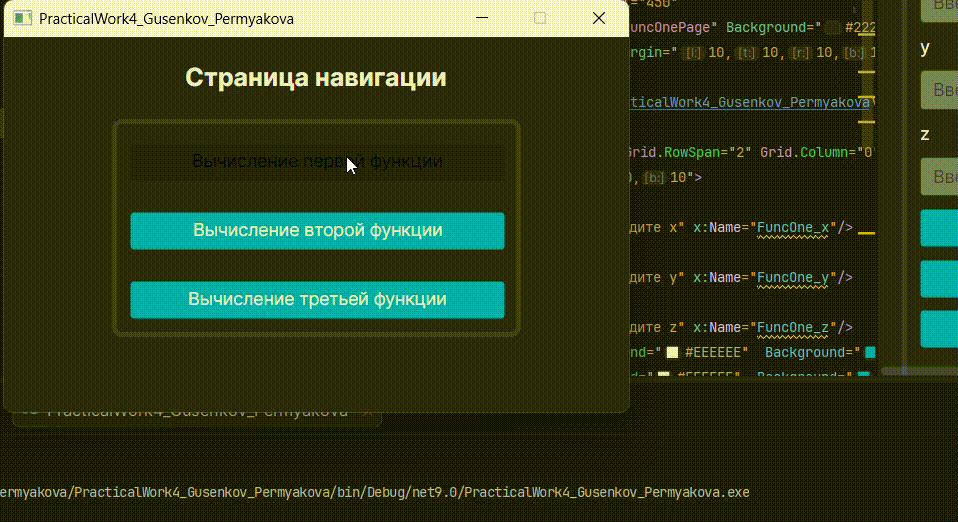

# Практическая работа 4


Практическая работа №4 по дисциплине **"Поддержка и тестирование программного обеспечения"**

**Авторы:** Гусенков В.А., Пермякова М.И.  
**Группа:** 3ИСИП-323  
**Преподаватель:** Аксенова Т.Г.   
**Учебное заведение:** КИПФИН

---

## Описание проекта

Десктопное приложение для вычисления и визуализации математических функций с использованием фреймворка **Avalonia UI**. Приложение предоставляет современный кроссплатформенный интерфейс для вычисления значений функций на заданном интервале и построения их графиков.

### Основные возможности

- ✅ Вычисление значений функций
- 📊 Визуализация результатов в виде интерактивных графиков
- 📈 Табличное представление вычисленных данных
- 🔄 Навигация между различными функциями
- ⚙️ Настройка параметров вычислений

---

## Технологический стек

| Технология | Версия | Назначение |
|------------|--------|-----------|
| **C#** | 10.0+ | Основной язык программирования |
| **.NET** | 9.0 | Платформа разработки |
| **Avalonia UI** | 11.0+ | Кроссплатформенный UI фреймворк |
| **LiveChartsCore.SkiaSharpView.Avalonia** | — | Построение интерактивных графиков |
| **WpfLikeAvaloniaNavigation** | — | Система навигации между страницами |

---

## Установка и запуск

### Требования

- [.NET SDK 6.0](https://dotnet.microsoft.com/download) или выше
- IDE: [Visual Studio 2022](https://visualstudio.microsoft.com/) / [JetBrains Rider](https://www.jetbrains.com/rider/) / [VS Code](https://code.visualstudio.com/)
- ОС: Windows, macOS, Linux

### Клонирование репозитория

```bash
git clone https://github.com/roadtoseniors/PracticalWork4_Gusenkov_Permyakova.git
cd PracticalWork4_Gusenkov_Permyakova
```

### Сборка и запуск

#### Через командную строку

```bash
dotnet restore
dotnet build
dotnet run --project PracticalWork4_Gusenkov_Permyakova
```

#### Через Visual Studio / Rider

1. Откройте файл `PracticalWork4_Gusenkov_Permyakova.sln`
2. Нажмите **F5** или кнопку **Run**

---

## Структура проекта

```
PracticalWork4_Gusenkov_Permyakova/
│
├── PracticalWork4_Gusenkov_Permyakova/
│   ├── Pages/
│   │   ├── NavigationPage.axaml
│   │   ├── NavigationPage.axaml.cs
│   │   ├── SimplePage.axaml
│   │   ├── SimplePage.axaml.cs
│   │   ├── FuncOnePage.axaml
│   │   ├── FuncOnePage.axaml.cs
│   │   ├── FuncTwoPage.axaml
│   │   ├── FuncTwoPage.axaml.cs
│   │   ├── FuncThreePage.axaml          # UI разметка страницы функции
│   │   └── FuncThreePage.axaml.cs       # Логика страницы функции
│   │
│   ├── Images/
│   │   ├── FuncTwo.jpg
│   │   ├── FuncThree.jpg
│   │   └── FuncOne.jpg  # Изображение формулы
│   │
│   ├── App.axaml                         # Глобальные стили приложения
│   ├── App.axaml.cs                      # Точка входа приложения
│   ├── MainWindow.axaml                  # Главное окно
│   └── MainWindow.axaml.cs
│
├── PracticalWork4_Gusenkov_Permyakova.sln
└── README.md
```

---

## Использование

### Вычисление функции

1. **Запустите приложение**
2. **Перейдите на страницу нужной функции** (например, Функция 3)
3. **Введите параметры:**
   - Коэффициент `b`
   - Начальное значение `x₀`
   - Конечное значение `xₖ`
   - Шаг `dx`
4. **Нажмите кнопку "Вычислить"**
5. **Результаты отобразятся:**
   - В таблице (значения x и y)
   - На графике (визуальное представление)

### Очистка данных

Нажмите кнопку **"Очистить"** для сброса всех введённых параметров и результатов.

### Навигация

Используйте кнопку **"Назад"** для возврата к главному меню (если реализовано).

---

## Дизайн интерфейса

### Цветовая схема

| Элемент | Цвет | HEX |
|---------|------|-----|
| Фон приложения | Тёмно-серый | `#222831` |
| Границы элементов | Серый | `#393e46` |
| Текст | Светло-серый | `#EEEEEE` |
| Кнопки | Бирюзовый | `#00adb5` |
| Фон таблицы/графика | Тёмно-серый | `#2d3339` |

---

## Конфигурация

### Изменение размеров окна

В файле `FuncThreePage.axaml` измените параметры:

```xml
d:DesignWidth="1200"   <!-- Ширина окна -->
d:DesignHeight="800"   <!-- Высота окна -->
```
---

## Пример работы приложения



---

## Возможные проблемы

- ⚠️ Функция √x не определена при x < 0 — выводится сообщение "Не определено"
- ⚠️ При слишком большом диапазоне значений график может быть недостаточно читаем
- ⚠️ Путь к изображению формулы задан абсолютно — при развертывании на другом ПК требуется корректировка

---

## 👥 Авторы

| Имя | Роль | Контакты |
|-----|------|----------|
| **Гусенков Вадим Алексеевич** | Разработчик | [@voodeex](https://github.com/voodeex) |
| **Пермякова Мария Ивановна** | Разработчик | [@roadtoseniors](https://github.com/roadtoseniors) |

---

## Контакты

По вопросам работы проекта обращайтесь к авторам или преподавателю.

**GitHub Repository:** [PracticalWork4_Gusenkov_Permyakova](https://github.com/roadtoseniors/PracticalWork4_Gusenkov_Permyakova)

---

<div align="center">

[⬆ Вернуться к началу](#practicalwork4_gusenkov_permyakova)

</div>
